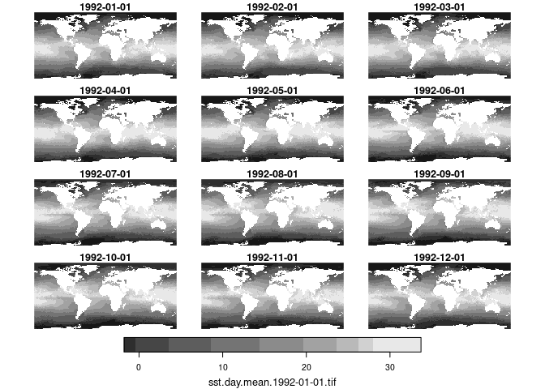

oisster
================

R tools to download and manage
[OISST](https://psl.noaa.gov/data/gridded/data.noaa.oisst.v2.highres.html)
data.

### Requirements

[R v4.2+](https://www.r-project.org/)

From CRAN

    + [rlang](https://CRAN.R-project.org/package=rlang)
    + [stars](https://CRAN.R-project.org/package=stars)
    + [ncdf4](https://CRAN.R-project.org/package=ncdf4)
    + [thredds](https://CRAN.R-project.org/package=thredds)
    + [dplyr](https://CRAN.R-project.org/package=dplyr)
    + [readr](https://CRAN.R-project.org/package=readr)

From github

    + [charlier](https://github.com/BigelowLab/charlier)

### Installation

    remotes::install_gitgub("BigelowLab/charlier")
    remotes::install_gitgub("BigelowLab/oisster")

### Data path

This package can be used to download and manage many GEOTIFF files in a
location **of your choosing.** You need to create and set the path once
before using the package (and if you ever change the data storage
location.) Let’s suppose that your data path is
`/mnt/ecocast/coredata/oisst`. Use the `set_root_path()` function first.

    oisster::set_root_path(`/mnt/s1/projects/ecocast/coredata/oisst`)

The function will save this information in a hidden file securely in
your home folder. Using the above allows you to return to working with
the data in later R sessions without the fuss of setting things up each
time.

### Get some data for the first time.

The package provides two functions for getting data, `fetch_year()` and
`fetch_dates()`. AS the name implies, `fetch_year` will download daily
OISST maps for a specified year. You can save data to a particular
region, but let’s just do the world for now.

Make the path…

``` r
suppressPackageStartupMessages({
  library(oisster)
  library(stars)
})
PATH <- oisster::oisst_path("world")
if (!dir.exists(PATH)) ok <- dir.create(PATH, recursive = TRUE)
```

Now download a year or two (this step takes some time, so not run in
this markdown.) Note that OISST actually starts in September of 1981 and
runs through “yesterday”, so there’s more data you can download.

    ok <- lapply(c(1982, 1983), fetch_year, path = PATH)

Next we need to build and save a database, which is stored as a CSV in
the data path. What is in my database contains more years than what is
downloaded above. But you get the idea.

``` r
DB <- build_database(PATH, save_db = TRUE)
DB
```

    ## # A tibble: 15,382 × 4
    ##    date       param per   trt  
    ##    <date>     <chr> <chr> <chr>
    ##  1 1981-09-01 sst   day   mean 
    ##  2 1981-09-02 sst   day   mean 
    ##  3 1981-09-03 sst   day   mean 
    ##  4 1981-09-04 sst   day   mean 
    ##  5 1981-09-05 sst   day   mean 
    ##  6 1981-09-06 sst   day   mean 
    ##  7 1981-09-07 sst   day   mean 
    ##  8 1981-09-08 sst   day   mean 
    ##  9 1981-09-09 sst   day   mean 
    ## 10 1981-09-10 sst   day   mean 
    ## # … with 15,372 more rows

The database may show that you have variants on the period (`per`) or
treatment (`trt`).

``` r
dplyr::count(DB, per, trt)
```

    ## # A tibble: 6 × 3
    ##   per   trt       n
    ##   <chr> <chr> <int>
    ## 1 ann   max      42
    ## 2 ann   mean     42
    ## 3 ann   min      42
    ## 4 ann   range    42
    ## 5 ann   sum      42
    ## 6 day   mean  15172

### Opening a series

If you filter the database to a subset of interest, say the beginning of
first of each month in 1992, then you can load them into a `stars`
array.

``` r
db <- dplyr::filter(DB,
                    param == 'sst',
                    per == 'day',
                    trt == 'mean',
                    date %in% seq(as.Date("1992-01-01"), length = 12, by = "month"))
db
```

    ## # A tibble: 12 × 4
    ##    date       param per   trt  
    ##    <date>     <chr> <chr> <chr>
    ##  1 1992-01-01 sst   day   mean 
    ##  2 1992-02-01 sst   day   mean 
    ##  3 1992-03-01 sst   day   mean 
    ##  4 1992-04-01 sst   day   mean 
    ##  5 1992-05-01 sst   day   mean 
    ##  6 1992-06-01 sst   day   mean 
    ##  7 1992-07-01 sst   day   mean 
    ##  8 1992-08-01 sst   day   mean 
    ##  9 1992-09-01 sst   day   mean 
    ## 10 1992-10-01 sst   day   mean 
    ## 11 1992-11-01 sst   day   mean 
    ## 12 1992-12-01 sst   day   mean

Now read them in…

``` r
S <- read_oisst(db, PATH)
plot(S)
```

    ## downsample set to 5

<!-- -->

### Generating annual summaries

You can use [this script](inst/scripts/annual_summaries.R) to generate
annual summaries from the dailies. Here we load 12 years of annual means
(computed from daily means) starting in 1992.

``` r
db <- dplyr::filter(DB,
                    param == 'sst',
                    per == 'ann',
                    trt == 'mean',
                    date %in% seq(as.Date("1992-01-01"), length = 12, by = "year"))
S <- read_oisst(db, PATH)
plot(S)
```

    ## downsample set to 5

<!-- -->
